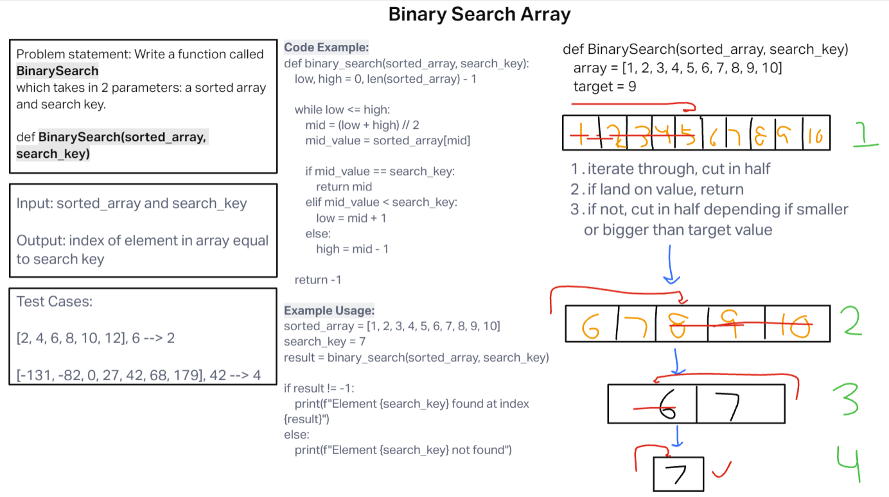

# Code Challenge: Class 03

<!-- Description of the challenge -->
Write a function called BinarySearch which takes in 2 parameters: a sorted array and the search key.

## Whiteboard Process
[Whiteboard Image 3](challenge3.png)

## Approach & Efficiency
<!-- What approach did you take? Why? What is the Big O space/time for this approach? -->

Used the forward/backward method. Both the Big o space/time for this approach were the O(n), where n is the length of the input array.

## Solution
<!-- Show how to run your code, and examples of it in action -->

def binary_search(sorted_array, search_key):
    low, high = 0, len(sorted_array) - 1

    while low <= high:
        mid = (low + high) // 2
        mid_value = sorted_array[mid]

        if mid_value == search_key:
            return mid
        elif mid_value < search_key:
            low = mid + 1
        else:
            high = mid - 1

    return -1

# Example usage:

sorted_array = [1, 2, 3, 4, 5, 6, 7, 8, 9, 10]
search_key = 7
result = binary_search(sorted_array, search_key)

if result != -1:
    print(f"Element {search_key} found at index {result}")
else:
    print(f"Element {search_key} not found")
