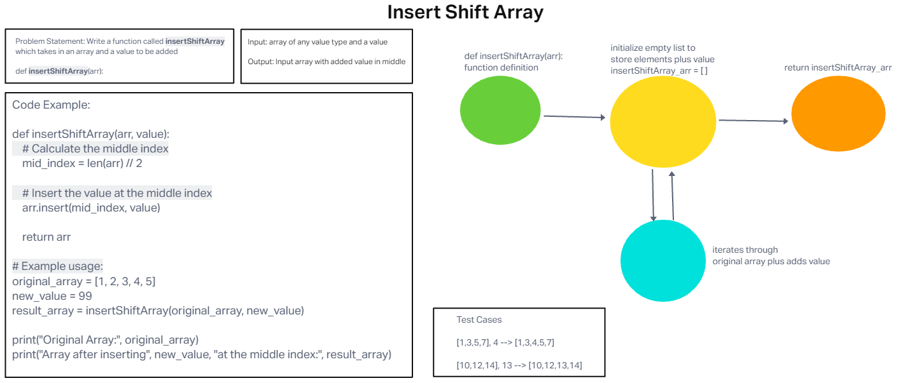

# Code Challenge: Class 02

<!-- Description of the challenge -->
Write a function called insertShiftArray which takes an array and a value to be added.

## Whiteboard Process
[Whiteboard Image 2](challenge2.png)

## Approach & Efficiency
<!-- What approach did you take? Why? What is the Big O space/time for this approach? -->

Used the forward/backward method. Both the Big o space/time for this approach were the O(n), where n is the length of the input array.

## Solution
<!-- Show how to run your code, and examples of it in action -->

def insertShiftArray(arr, value):

    # Calculate the middle index
    middle_index = len(arr) // 2

    # Insert the value at the middle index
    new_array = arr[:middle_index] + [value] + arr[middle_index:]

    return new_array

# Example Usage

original_array = [1, 2, 3, 4, 5]

new_value = 99

modified_array = insertShiftArray(original_array, new_value)

Original Array: [1, 2, 3, 4, 5]

Modified Array: [1, 2, 3, 99, 4, 5]

print("Original Array:", original_array)

print("Modified Array:", modified_array)

