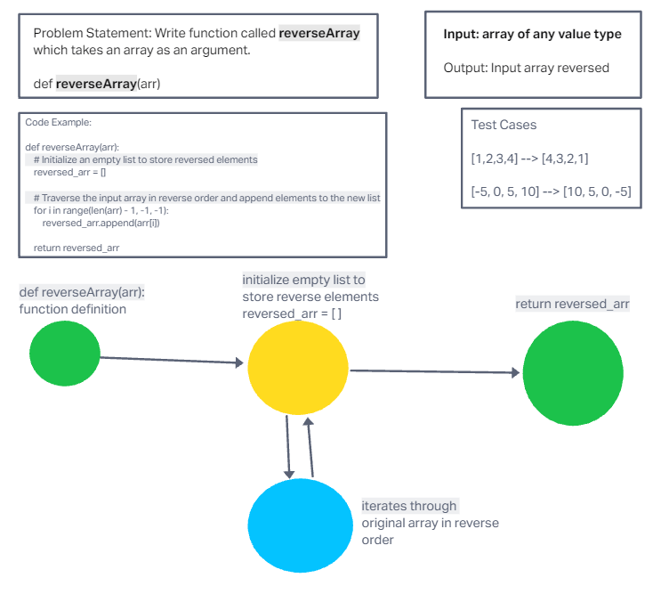

# Code Challenge: Class 01

<!-- Description of the challenge -->
Write a function called reverseArray which takes an array as an argument.

## Whiteboard Process
[Whiteboard Image](challenge1.png)

## Approach & Efficiency
<!-- What approach did you take? Why? What is the Big O space/time for this approach? -->

Used the forward/backward method. Both the Big o space/time for this approach were the O(n), where n is the length of the input array.

## Solution
<!-- Show how to run your code, and examples of it in action -->

def reverseArray(arr):
    # Initialize an empty list to store reversed elements
    reversed_arr = []
    
    # Traverse the input array in reverse order and append elements to the new list
    for i in range(len(arr) - 1, -1, -1):
        reversed_arr.append(arr[i])
    
    return reversed_arr

# Example usage:
original_array = [1, 2, 3, 4, 5]

reversed_array = reverseArray(original_array)

print("Original Array:", original_array)

print("Reversed Array:", reversed_array)
