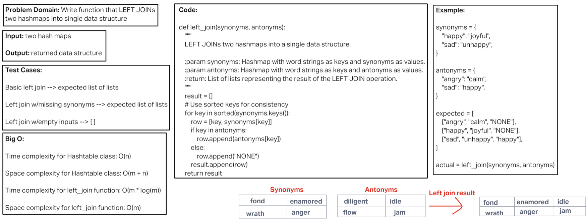

# Challenge Title
<!-- Description of the challenge -->
Hashmap Left Join

## Whiteboard Process
<!-- Embedded whiteboard image -->

[Whiteboard Image 33](challenge33.png)

## Approach & Efficiency
<!-- What approach did you take? Why? What is the Big O space/time for this approach? -->

Time complexity for Hashtable class: O(n)

Space complexity for Hashtable class: O(m + n)

Time complexity for left_join function: O(m * log(m))

Space complexity for left_join function: O(m)
 
## Solution
<!-- Show how to run your code, and examples of it in action -->

def left_join(synonyms, antonyms):
    """
    LEFT JOINs two hashmaps into a single data structure.

    :param synonyms: Hashmap with word strings as keys and synonyms as values.
    :param antonyms: Hashmap with word strings as keys and antonyms as values.
    :return: List of lists representing the result of the LEFT JOIN operation.
    """
    result = []
    # Use sorted keys for consistency
    for key in sorted(synonyms.keys()):
        row = [key, synonyms[key]]
        if key in antonyms:
            row.append(antonyms[key])
        else:
            row.append("NONE")
        result.append(row)
    return result
