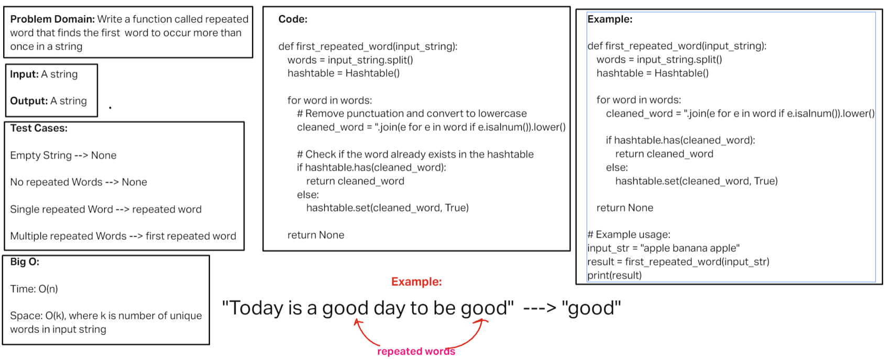

# Challenge Title
<!-- Description of the challenge -->
Hashmap Repeated Word

## Whiteboard Process
<!-- Embedded whiteboard image -->

[Whiteboard Image 31](challenge31.png)

## Approach & Efficiency
<!-- What approach did you take? Why? What is the Big O space/time for this approach? -->

Time complexity: O(n)

Space complexity: O(k), where k is number of unique words in input string
 
## Solution
<!-- Show how to run your code, and examples of it in action -->

def first_repeated_word(input_string):
    words = input_string.split()
    hashtable = Hashtable()

    for word in words:
        # Remove punctuation and convert to lowercase
        cleaned_word = ''.join(e for e in word if e.isalnum()).lower()

        # Check if the word already exists in the hashtable
        if hashtable.has(cleaned_word):
            return cleaned_word
        else:
            hashtable.set(cleaned_word, True)

    return None
