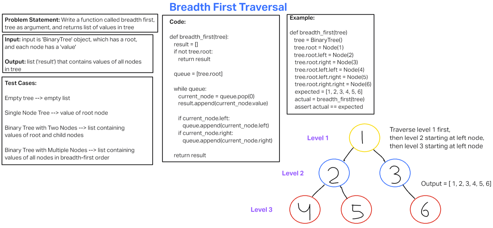

# Code Challenge: Class 17 Breadth-first Traversal
<!-- Description of the challenge -->

Write a function called breadth first, with tree as argument, and returns a list of values in the tree, in order they were encountered.

## Whiteboard Process
<!-- Embedded whiteboard image -->

[Whiteboard Image 17](challenge17.png)

## Approach & Efficiency
<!-- What approach did you take? Why? What is the Big O space/time for this approach? -->

The time complexity (Big O) of the breadth-first traversal algorithm you've implemented is O(N), where N is the number of nodes in the binary tree. In the worst case, you have to visit each node once.

## Solution
<!-- Show how to run your code, and examples of it in action -->

def breadth_first(tree):
    result = []
    if not tree.root:
        return result

    queue = [tree.root]

    while queue:
        current_node = queue.pop(0)
        result.append(current_node.value)

        if current_node.left:
            queue.append(current_node.left)
        if current_node.right:
            queue.append(current_node.right)

    return result
