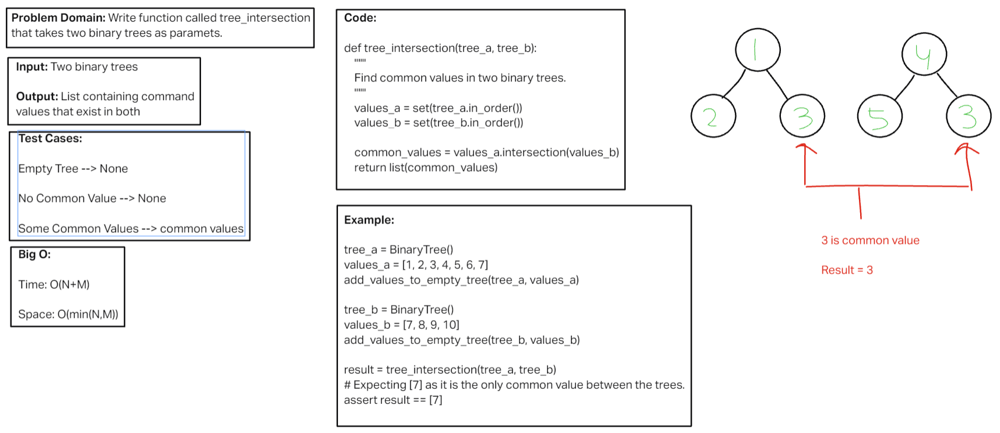

# Challenge Title
<!-- Description of the challenge -->
Tree Intersection

## Whiteboard Process
<!-- Embedded whiteboard image -->

[Whiteboard Image 32](challenge32.png)

## Approach & Efficiency
<!-- What approach did you take? Why? What is the Big O space/time for this approach? -->

Time complexity: O(n+m)

Space complexity: O(min(n, m))
 
## Solution
<!-- Show how to run your code, and examples of it in action -->

def tree_intersection(tree_a, tree_b):
    """
    Find common values in two binary trees.
    """
    values_a = set(tree_a.in_order())
    values_b = set(tree_b.in_order())
    
    common_values = values_a.intersection(values_b)
    return list(common_values)
