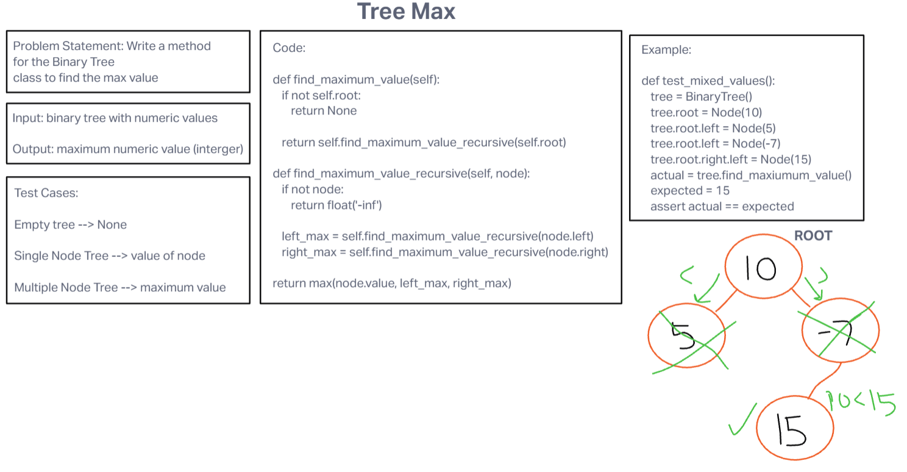

# Code Challenge: Class 16 Tree Max
<!-- Description of the challenge -->

Write a method for the Binary Tree class to find the max value.

## Whiteboard Process
<!-- Embedded whiteboard image -->

[Whiteboard Image 16](challenge16.png)

## Approach & Efficiency
<!-- What approach did you take? Why? What is the Big O space/time for this approach? -->

The time complexity (Big O) of the find_maximum_value method in the provided implementation is O(N), where N is the number of nodes in the binary tree.

## Solution
<!-- Show how to run your code, and examples of it in action -->

def find_maximum_value(self): # need to edit this
        if not self.root:
            return None
        
        return self.find_maximum_value_recursive(self.root)
    
    def find_maximum_value_recursive(self, node):
        if not node:
            return float('-inf')
        
        left_max = self.find_maximum_value_recursive(node.left)
        right_max = self.find_maximum_value_recursive(node.right)

        return max(node.value, left_max, right_max)
